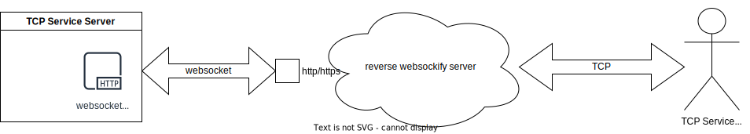

# Reverse Websockify

Inspired by noVNC's Websockify, but in the reverse direction: the TCP service side acts as the WebSocket client, instead of the WebSocket server.

## Topology



The TCP service's server side and user side are behind NAT, making it inaccessible to the user side directly.

The Reverse Websockify server is exposed to the internet, allowing the TCP service side and user side to rendezvous there.

### Why Use Websocket
There are many rendezvous solutions available, but deploying them in a large company with strict security policies often violates these rules.

However, HTTP/HTTPS is typically allowed to be exposed to the internet, and mature, safe scanning tools exist to discover any potential vulnerabilities. Therefore, WebSocket is chosen for the service side forwarding.

Now, why is the user side still directly accessing the forwarded TCP service port?
- It is the TCP service's responsibility to secure its access.
- Well-known TCP services like Kafka and HTTP are not restricted in most companies.
- The TCP user mostly uses the company's intranet to access the rendezvous server. In this case, the rendezvous server only exposes the forwarded TCP service port on the intranet, not the internet.

## Deployment
Let's deploy the Reverse Websockify service and expose the WebSocket access endpoint as a self-signed HTTPS at port 443.

To enhance security, we have enabled HTTPS client-side certificate verification.

### Rendezvous Server Deployment
Deployment folder structure:

- docker-compose.yaml
- nginx.conf
- reverse_websockify_server
- config.toml
- tls/

Deployment steps:

1. Generate the self-signed certificates for nginx.

**Remember to adjust `-subj` to fit your needs, especially ensuring the `CN` matches your server's internet IP or hostname.**
```bash
#!/bin/bash
openssl req -x509 -nodes -days 3650 -newkey rsa:2048 -keyout tls/server.key.pem -out tls/server.cert.pem \
    -subj "/C=CN/ST=Beijing/L=Beijing/O=MyCompany/OU=MyBusinessUnit/CN=my.rendezvous.com"
```

2. Configure nginx to wrap HTTPS around the Reverse Websockify server, assuming the provided config.toml is used which makes the Reverse Websockify server host HTTP at 127.0.0.1:39000.

```nginx
# for internet acess, the Websockify endpoint is only served here
server {
    listen 443 ssl default_server;
    server_name  _;
    gzip off;

    ssl_certificate /tls/server.cert.pem;
    ssl_certificate_key /tls/server.key.pem;
    # Only allow clients with CA-signed certificates.
    ssl_verify_client on;
    ssl_client_certificate /tls/server.cert.pem;

    location /forward_to_me/ {
        proxy_pass http://127.0.0.1:39000;
        proxy_set_header Host $http_host;
        proxy_redirect off;
        proxy_http_version 1.1;
        proxy_set_header X-Real-Ip $remote_addr;
        proxy_set_header Upgrade $http_upgrade;
        proxy_set_header Connection "upgrade";
        proxy_buffering off;
    }
}
# for intranet admin access, used to quickly check the current Reverse Websockify server status.
server {
    listen 80;

    location = / {
        proxy_pass http://127.0.0.1:39000;
        proxy_set_header Host $http_host;
        proxy_redirect off;
        proxy_http_version 1.1;
    }
}
```

3. Use Docker Compose to launch the rendezvous deployment.
```yaml
services:
  nginx:
    image: nginx:latest
    network_mode: host
    volumes:
      - ${PWD}/nginx.conf:/etc/nginx/conf.d/default.conf:ro
      - ${PWD}/tls:/tls:ro
    restart: always

  reverse_websockify_server:
    image: nginx:latest
    network_mode: host
    volumes:
      - ${PWD}:/project
    command: 
      - /project/reverse_websockify_server
      - /project/config.toml
    restart: always
```

### TCP Service Side Agent Deployment
1. Generate a client-side certificate using the previously self-signed server certificate and secret to sign it:

```bash
#!/bin/bash
# Generate a new key for client
openssl genrsa -out client.key.pem 4096
# Generate a new cert request for the client with the key
openssl req -subj '/CN=client' -new -key client.key.pem -out client.csr
# Sign the cert with server cert as CA
echo extendedKeyUsage = clientAuth > client-extfile.cnf
openssl x509 -req -days 3650 -sha256 -in client.csr -CA server.cert.pem -CAkey server.key.pem \
  -CAcreateserial -out client.cert.pem -extfile client-extfile.cnf
rm client.csr client-extfile.cnf
```

2. Pack the `client.cert.pem` `client.key.pem` `server.cert.pem`, and executable `reverse_websockify_agent_service_side` to the TCP service server, then directly launch or wrap a systemd service around it:
```bash
./reverse_websockify_agent_service_side \
  --service=127.0.0.1:36000 \
  --reverse-websockify=wss://my.rendezvous.com/forward_to_me/LKLAFA151NA774655 \
  --client-cert=client.cert.pem --client-key=client.key.pem --ca-cert=server.cert.pem
```

Lookup the LKLAFA151NA774655 in the example config.toml: it binds to the rendezvous server port 39036. Any TCP service user connecting to the rendezvous server's port 39036 will eventually be forwarded and connected to the TCP service at 127.0.0.1:36000.